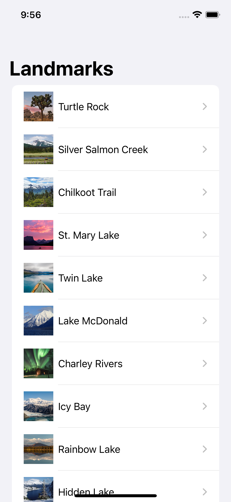
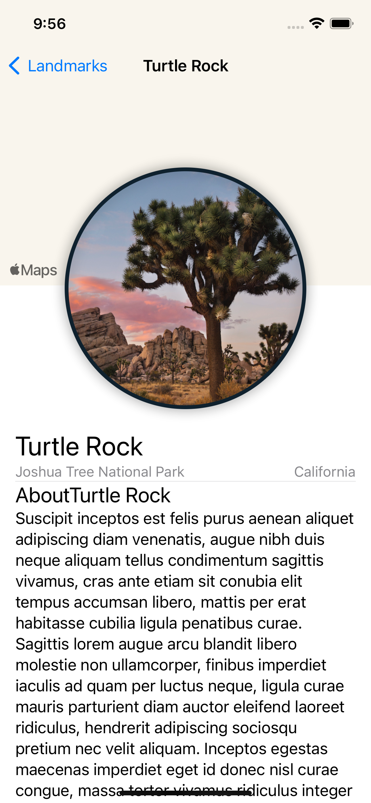

# Landmarks

## About
A  App to see Infos about some popular Landmarks in the U.S.A.

## Purpose
The purpose of this project was to learn the swift programming language and how to develop apps for apple devices. 

## Technologies used
* Swift
* SwiftUI
* Xcode
* Object oriented programming
* Simulators
  

# Inapp
### App Home

### Selected Landmark

